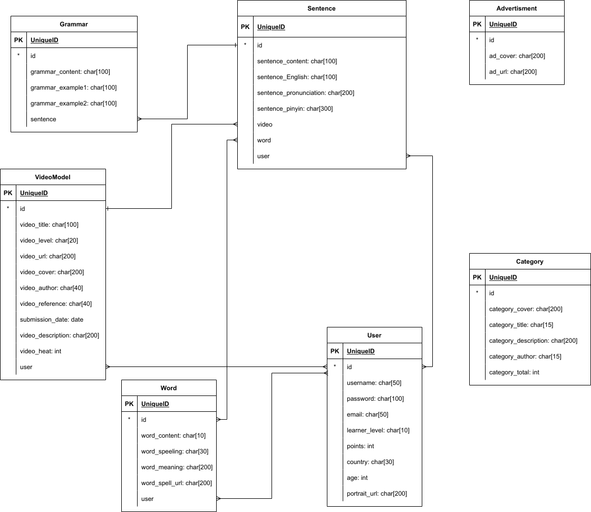
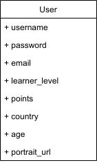

# 项目文档
## E-R 图

## 数据字典

<!-- Todo: 拆分出多对多的表 -->
### VideoModel

|Fields|Type|Reference To|Cardinality|
|:-----|:---|:-----------|:----------|
|id|Primary Key|Sentence(video)| One-to-Many|
|video_title| char[100] | - | - |
|video_level| char[20] | - | - |
|video_url| char[200] | - | - |
|video_cover| char[200] | - | - |
|video_author| char[40] | - | - |
|video_reference| char[40] | - | - |
|video_description| char[200] | - | - |
|video_description| int | - | - |
|submission_date| date | - | - |
|user|int| User(id) | Many-to-Many|

### Grammar

|Fields|Type|Reference To|Cardinality|
|:-----|:---|:-----------|:----------|
|id|Primary Key| - | - |
|grammar_content| char[100] | - | - |
|grammar_example1| char[100] | - | - |
|grammar_example2| char[100] | - | - |
|sentence| int | Sentence(id) | Many-to-One |

### Sentence

|Fields|Type|Reference To|Cardinality|
|:-----|:---|:-----------|:----------|
|id|Primary Key| char[100] | Grammar(sentence) | One-to-Many |
|sentence_content| char[100]| - | - |
|sentence_english| char[100] | - | - |
|sentence_pronunication| char[200] | - | - |
|sentence_pinyin| char[300] | - | - |
|video| int | VideoModel(id) | Many-to-One |
|word| int | Word(id) | Many-to-Many
|user| int | User(id) | Many-to-Many

### Word

|Fields|Type|Reference To|Cardinality|
|:-----|:---|:-----------|:----------|
|id|Primary Key|Sentence(id) | Many-to-Many
|word_content| char[10] | - | - |
|word_speeling| char[30]| - | - |
|word_meaning| char[200] | - | - |
| word_spell_url| char[200]| - | - |
|user| int | User(id) | Many-to-Many |

### User

|Fields|Type|Reference To|Cardinality|
|:-----|:---|:-----------|:----------|
|id|Primary Key|Word(user),VideoModel(user),Sentence(user) | Many-to-Many
|username| char[50]| - | - |
|password| char[100] | - | - |
|email| char[50] | - | - |
|learner_level| char[10] | - | - |
|points| int | - | - |
|country | char[30] | - | - |
|age| int | - | - |
|portrait_url| char[200]| - | - |

### Category

|Fields|Type|Reference To|Cardinality|
|:-----|:---|:-----------|:----------|
|id|Primary Key| - | - |
|category_cover| char[200]| - | - |
|category_title| char[15] | - | - |
|category_description| char[200] | - | - |
|category_author | char[15]| - | - |
|category_total | int | - | - |

### Advertisement

|Fields|Type|Reference To|Cardinality|
|:-----|:---|:-----------|:----------|
|id|Primary Key| - | - |
|ad_cover| char[200] | - | - |
|ad_url| char[200]| - | - |

## 技术架构

网站部署在云端, 采用C/S架构. , 因为项目试验成分较大, 为了便于开发修改和调试, 采用基于Python的Django作为后端逻辑处理, 而轻量小巧的sqlite作为数据库, 减少部署和迁移成本.

## 功能模块设计

<!-- 做个图吧 -->

## 关键功能/算法设计

使用Cookies管理用户登录状态. 弥补了HTTP无状态导致无法识别用户登录情况的问题. 围绕Cookies设计的用户

## 接口设计

<!-- 使用另外两个文档 -->

## 关键数据结构

### User

### LoginForm

